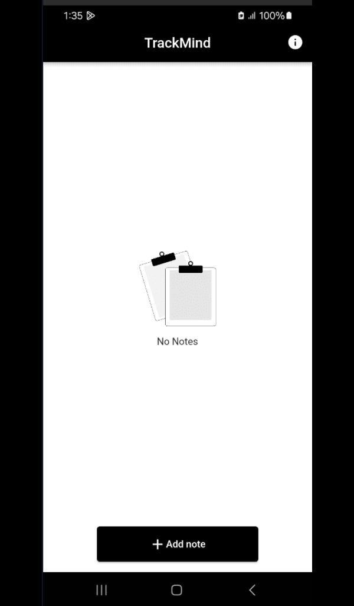
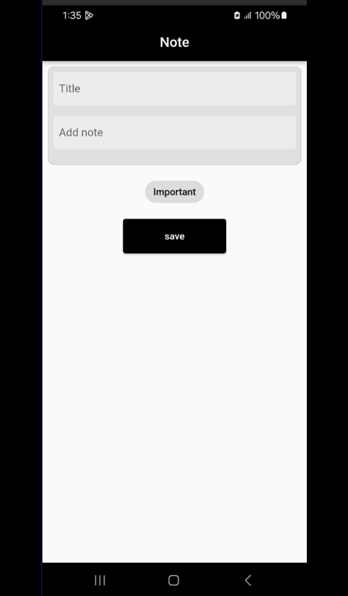
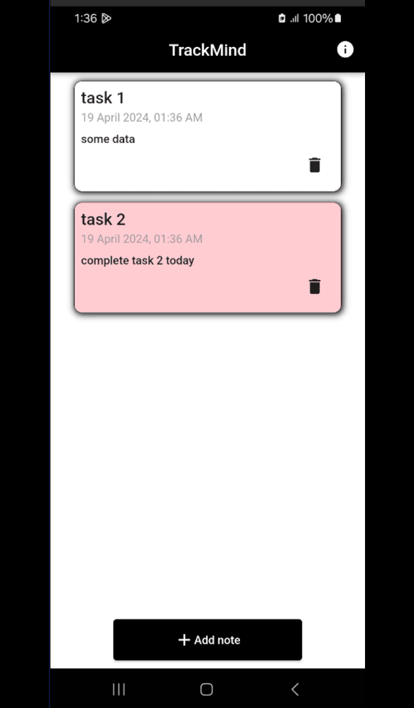

# TrackMind

A flutter application build using sqlflite to management our task.

 TrackMind is a user-friendly to-do app, offering seamless task management with offline capabilities. Create, update, and organize notes effortlessly with a simple UI designed for all users. No data is shared with third parties, ensuring your information stays secure. Take control of your tasks with TrackMind, the trusted companion for managing your to-do list with ease.

##  App UI

